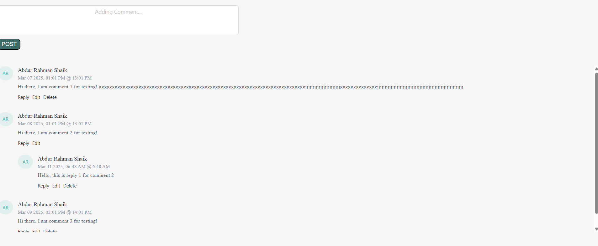

# comments-section
A react component using which users can add, edit, delete or reply comments.

Currently UI looks like this:



Usage:

```
import React, { useState } from "react";
import { Comments } from "comments-section";

// currentUserId: string,
//         currentUserName: string,
//         apis: {
//             getCommentsApi: () => any,
//             createCommentApi: (text: string, parentId: string, currentUserId: string, currentUserName: string) => any,
//             updateCommentApi: (text: string, commentId: string, currentUserId: string, currentUserName: string) => any,
//             deleteCommentApi: (commentId: string) => any
//         }

const Dummy = () => {
    const [state, updateState] = useState({ comments: [] });
    return (
        <>
            Hello, I am a dummy file created by Abdur!
            <Comments
                currentUserId="Abdur1R"
                currentUserName="Abdur Rahman Shaik"
                apis={{
                    getCommentsApi: async () => {
                        const initialState = [
                            {
                                id: "1",
                                username: "Abdur Rahman Shaik",
                                userId: "Abdur1R",
                                body: "Hi there, I am comment 1 for testing! ggggggggggggggggggggggggggggggggggggggggggggggggggggggggggggggggggggggggggggggjjjjjjjjjjjjjjjjjjjjjjjggggggggggggggjjjjjjjjjjjjjjjjjjjjjjjjjjjjjjjjjjjjjjjjjjjjjjjjjjjjjjjjj",
                                createdAt: "2025-03-07T18:01:03Z",
                                parentId: null
                            },
                            {
                                id: "2",
                                username: "Abdur Rahman Shaik",
                                userId: "Abdur1R",
                                body: "Hi there, I am comment 2 for testing!",
                                createdAt: "2025-03-08T18:01:03Z",
                                parentId: null
                            },
                            {
                                id: "3",
                                username: "Abdur Rahman Shaik",
                                userId: "Abdur1R",
                                body: "Hi there, I am comment 3 for testing!",
                                createdAt: "2025-03-09T18:01:03Z",
                                parentId: null
                            },
                        ];
                        updateState((prev: any) => (
                            { ...prev, comments: initialState }
                        ));
                        return initialState;
                    },
                    createCommentApi: async (text: string, parentId: string, currentUserId: string, currentUserName: string) => {
                        return {
                            id: state.comments.length,
                            username: currentUserName,
                            userId: currentUserId,
                            body: text,
                            createdAt: (new Date()).toISOString().slice(0, 19).replace("T", "T"),
                            parentId
                        };
                    },
                    updateCommentApi: async (text: string, commentId: string, currentUserId: string, currentUserName: string) => {
                        const updatedBackendComments = state.comments.map((backendComment: any) => {
                            if (backendComment.id === commentId) {
                                return { ...backendComment, body: text };
                            }
                            return backendComment;
                        });
                        updateState((prev: any) => ({ ...prev, comments: updatedBackendComments }));
                    },
                    deleteCommentApi: async (commentId: string) => {
                        const updatedBackendComments = state.comments.filter(
                            (backendComment: any) => backendComment.id !== commentId
                        );
                        updateState((prev: any) => ({ ...prev, comments: updatedBackendComments }));
                    },
                }}
            />
        </>
    )
};

export default Dummy;
```
